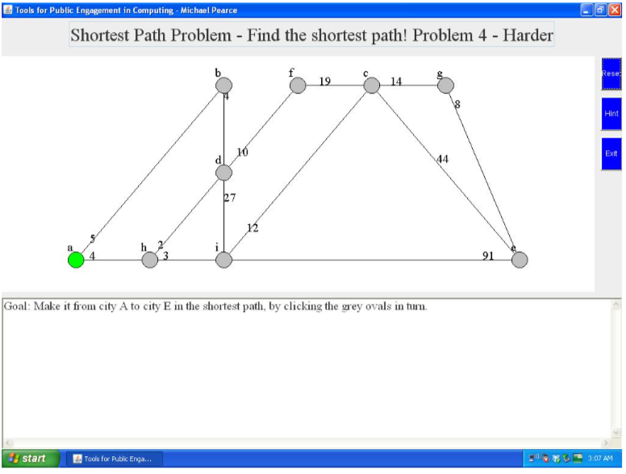
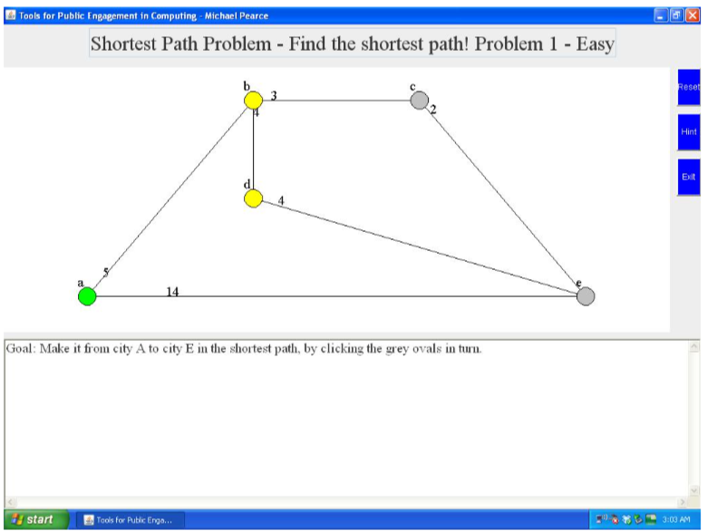
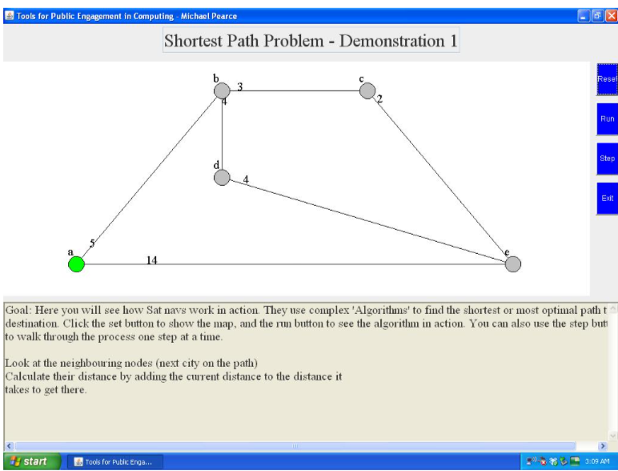
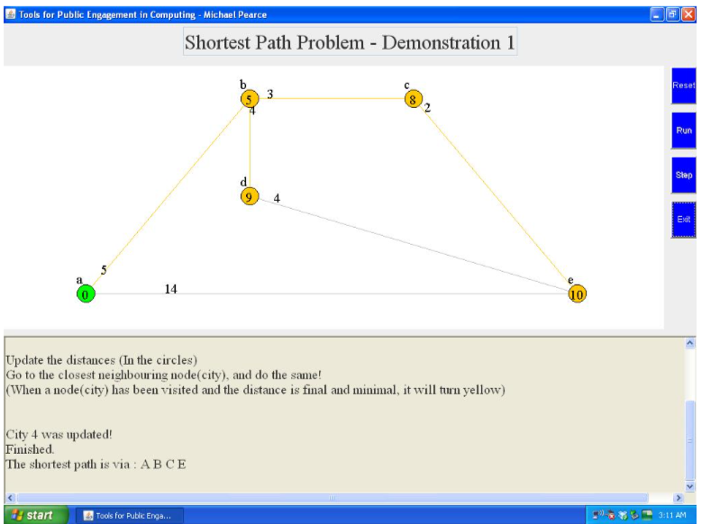
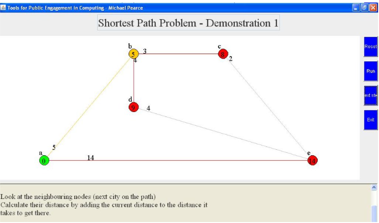

# Tools for Public Engagement in Computing
### University Project - 2013

## Abstract
Providing problem solving activities (web/Java application) to engage users of the
community in some of the underlying principles of Computer Science (graphs and
applications/algorithms).
Aimed at Maths and ICT teachers of late primary schools/early secondary school, to
aim and promote potential future curriculum changes focusing on an emphasis on
Computing.
Maths and ICT teachers are those that are most likely to understand and make use of
the learning tool, as they may have to/want to understand the logical thinking and
concepts that are involved.

The application is designed to set short challenges of which you (the user) can relate too real life, and attempt to apply a logical, algorithmic thinking to in order to solve the problem.
The application then provides some demonstrations to aid further engagement and understanding and will finish with a final challenge to re-construct the demonstrated algorithm from the provided possible solutions. 

Step through, run or click
Goal: Make it from city A to city H in the shortest path, by clicking the grey ovals in turn.

# Examples
### Example Problem - Start


### Easy Problem - Visibilty of system status
Inline-style: 


### Example Demonstration - Start


### Example Demonstration - Stepping through


### Demonstration 1 - Visiblity of system status, and explanation



# Know Issues

## Overridden or Deprecated APIs
* Window .show()
* Size in component 
* stop() in thread
* Action (event, object) in component

## Applet problem
I used my own button class rather than jbuttons, and a frame rather than jframe.

This was because of my choice to create a Java Applet. An Applet opening a JFrame is fine, and so would a JFrame opening another JFrame, but because Java Applets are for creating web applications (recall the ability to run as on a desktop or as a web application), opening an Applet from another Applet would be unsuccessful. A possible solution for this may be to instead of opening another window (and closing the current one), replacing the content of the current applet instead. In future I could do more research into this idea, and possibly implement it. 

# Implementation
## Main Classes
The application layout consists of four main sections of the main frame. These sections are implemented in a respective class each.

### Title
The Title class extends the Java Panel class, and contains the title field. Creating a dedicated Title class allowed me to add the title field to the panel and set properties such as editable and font style and size.

### Buttons
The Buttons class creates the buttons needed for the application, and sets the layout within the main frame. Each button is named with a string which is later passed as an argument to the Java Action class.

### GraphCanvas
GraphCanvas is the most complex class. This class sets the graph, and draws it on screen. Some of the main operations of the application such as init(), runApp(), DjikstraAlgorithm(), nodeHit(), checkPath() etc. are applied to this class.

### InfoText
Info Text is a class that extends the Java TextArea class, that sets the initial information text, and allows the GraphCanvas class to later in the program edit the text and properties of the information text.


### Dijkstra’s algorithm
The application I created for the project makes use of Djikstra’s algorithm. This algorithm is a heavy influence in the field of path finding problems. Djikstra’s algorithm is used for finding the shortest path between two nodes on a weighted graph (a graph in which the edges have a cost attached).
Each node in the graph is initialised with the value of either zero or infinity (This is up to the programmers discretion. Zero tends to be more easily representable in most programming languages, although infinity is often represented by -1.). These values will change throughout the run of the algorithm as the minimum distance to the node is calculated, and may change several times. Each node starts as ‘unvisited’. Later in the algorithm this will change to visited, to make sure the same nodes and paths are not checked more than once. The edges between nodes are all weighted with a non-negative cost, that may represent distance, time, monetary cost etc. These weights do not change at all throughout the run of the algorithm. These weights are used to calculate the minimal value to each node.
Djikstra’s algorithm can be used to find the shortest distance from one node to all other reachable nodes on a graph. From these calculations we can also find the shortest path between the start node and one other destination node.
An Important part of Djikstra’s algorithm is book keeping. Book keeping allows the algorithm to keep track of certain values such as the currently minimal distance to a particular node. As a shorter path to that node is found, the values need to been updated. The algorithm can use book keeping to keep track of which value has been updated and once the algorithm is complete we can trace the path backwards and find the shortest path to the destination node. Another interesting aspect of the algorithm is its polynomial running time. This means the algorithm runs in a time bounded by a polynomial function of the input size. In this case the algorithm will touch each node and each edge at least once. For smaller problems the algorithm we use is often not of too much concern, but as the size of the problem increases the value of the efficiency increases in correlation. If an algorithm takes too long to compute a solution, it may be of no practical use. When a polynomial running time cannot be found for a problem this is known as non-deterministic polynomial-time. This involves testing all candidate solutions at the same time, verifying whether it can be correctly solved in polynomial time. Of course a solution in polynomial time is more desirable that a solution in non-deterministic polynomial-time.

### Drawing Graphs on screen
In order for the application to be user friendly to the target audience it should be a graphical user interface. To represent the graphs used in the problem solving exercises and the demonstrations they would need to be drawn on screen for the user to see and interact with. To do this I used methods from the Abstract Windowing Toolkit (AWT) Graphics class. For example to draw nodes on screen I used the drawOval class, and passed the relevant coordinates as parameters. As shown below.
```java
graph.drawOval(node[i].x-NODEROOT, node[i].y-NODEROOT, NODESIZE, NODESIZE);
```
I then used the “drawString” method to write the nodes ‘names’ to screen. This required the coordinates for the positioning of the string to be passed as parameters as well as the name. To give each node a name I created my own toString method that returned a char type value that represents the node. As shown below.
```java
graph.drawString(intToString(i), node[i].x-14, node[i].y-14);
```
To hold the graph I have used an array structure. I have used several data types such as Point, and some other primitive data types such as float, integer (int) and boolean. Point was used for 2 dimensional arrays representing coordinates such as the x and y axis position of the start point and end point. I used float to represent direction x and direction y arrays. I used int for arrays of whole numbers such as distance, final distance, weight etc. I used boolean to indicate changes made to distances during the run of the algorithm.

When drawing a graph on screen, the total number of nodes are created in an array, with initial values set to 0. Within the same for loop, elements are created in the weight array.

Then or each individual problem or demonstration each node element in the node array is assigned a new Point value indicating the position on screen relevant to the height and width of the screen.
```java
    int w, h; // width and height
    ...
    node[1]=new Point(3*w, h);
    ...
```
When the nodes have been assigned a position I then assigned a weight between two nodes. So for example, between node 0 and node 1, the weight of the edge is 5.

`weight[0][1]=5;`

I then needed to update the arrows that represented edges between nodes. The method to do this is given the two nodes to draw between and the weight to label the edge.

`arrowupdate(i, j, weight[i][j]);`

The arrows are inserted initially using the Java `drawLine` method.
```java
graph.drawLine(startp[i][j].x, startp[i][j].y, endpoint[i][j].x, endpoint[i][j].y);
```

### Resetting Graphs
To reset the graph at any time, it is necessary to clear the screen and provide a fresh new graph with unaltered values. So for all the nodes up to the total number of nodes, the point values, and weight are set to 0 and the canvas is re painted using the `repaint` method. The application is then initialised using `init` method (short for initilise), that resets the graph using the values provided for that graph.

### Mouse clicks
In order to make the application interactive I needed a way of communicating the users actions within the application. I decided the best way to do this was with simple mouse clicks by the user.

### Buttons
For simple actions such as Reset, Run, Step, Hint, Exit etc. I provided specific buttons for each task. I created a new data type called Button, which allowed me to apply methods that would allow me to customise the background colour, foreground font colour, and set an enabled or disabled status variable. Then using the action method provided by the javax package, if the event target is an instance of a Button, the program compares the string of the Button and performs tasks accordingly.
```java
 if (evt.target instanceof Button)
{
     if (((String)arg).equals("Run"))
     {
         parent.graphcanvas.runapp();
... ```

### Hint button
For the problem solving section of the application, there is a button available that provides the user with hints on how to solve the problem if they are unsure. The actions of this button are a little more complex as it is set to display a message dialogue box showing a different hint each time. To do this the program must keep track of the current hint number, and increment it each time a new hint is displayed. The dialogue box displays the element of a String type array of hints corresponding with the current hint number. When the hint number is the total number of hints, it is reset to zero to restart the hints loop.

```java
JOptionPane.showMessageDialog(null, Problem1.hints[Problem1.hintNo]);
             Problem1.hintNo++;
             if(Problem1.hintNo==3){Problem1.hintNo=0;}
...
```

### Selecting a path and calculating the users result
When the user is presented with the graph on screen they are then of course tested with the task of finding the shortest path. To do this and to input the users answer to the problem the user clicks each nodes they believe to be on shortest path in turn. As they do so the clicked node turns yellow to provide the user with instant feedback. The first part of implementing this was the ‘node detection’, programmed to work out if the user has clicked a node or not. To do this the `MouseDown` method calls the `nodeHit()` method providing x and y co-ordinates and distance values as parameters, which are then evaluated returning either true or false. If the result is true, the `PaintNodeYellow` variable is set to true, then on `MouseUp` (as the user lets go of the mouse button) if PaintNodeYellow() is set to true, the colour of that node is set to Yellow. The node hit is also added to a `nodesHit` array, to keep track of the nodes the user has clicked, and in what order. Each time a node is clicked the path is checked with the `checkPath()` method that compares an array of integers containing the correct path, and an array of integers containing the nodes clicked by the user so far. The integers in the arrays represent the node number (the nth element in the node array). The method uses the `Arrays` class, and the `equals` method to compare the two arrays and return either true or false. During the design of the application, I considered the idea of the user clicking the start node as part of the path or not. To accommodate this I set two arrays, one including the first node, and one without, the users path is compared with both and if either one is true, the result is returned as true. Every time a node is clicked, after this is done the program then checks to see which node was just clicked. If the user has just clicked the final node the result of the path checking triggers a message dialogue either congratulating the user and preparing them for the next problem, or letting them know they were unsuccessful in selecting the shortest path, and asking if they require a hint before trying again.

# Additional Features/Ideas
* Linking classes
* Distance Counter
* Undo Function
* Travelling Salesman Problem
